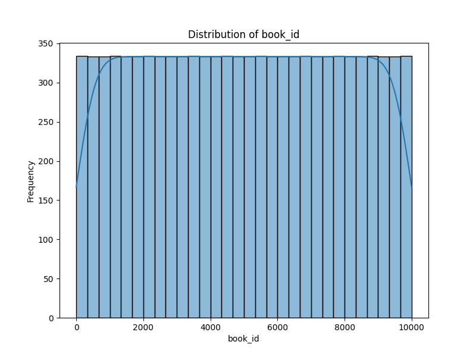
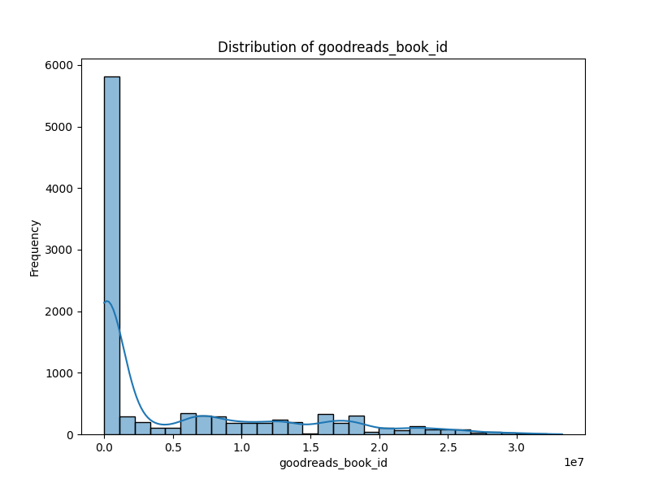

# Dataset Story

Based on the analysis of your dataset and the accompanying images, here are the insights:

### Dataset Overview
- **Shape**: The dataset consists of **10,000 rows** and **23 columns**, which provides a robust sample for analysis.
- **Columns**: The dataset includes various attributes relevant to books, such as identifiers (`book_id`, `goodreads_book_id`, `work_id`), bibliographic details (`authors`, `original_publication_year`, `title`, `language_code`), ratings data, and imagery URLs.

### Missing Values
The analysis reveals the following key points regarding missing values:
- **ISBN and ISBN13**: A significant number of records are missing ISBN (`700 missing`) and ISBN13 (`585 missing`). Since these identifiers are crucial for linking to external databases, this could hinder certain analyses.
- **Original Publication Year**: There are **21 missing entries** in the `original_publication_year`, which might affect any time-based analyses or comparisons.
- **Original Title**: The `original_title` has **585 missing values**, which may impact the context for some books, especially translations or editions.
- **Language Code**: **1,084 missing values** in the `language_code` column suggest a lack of language identification for a considerable number of books, which may limit cross-linguistic analysis.
- **Other Columns**: The remaining columns do not exhibit missing values, providing a solid foundation for analyzing the ratings and reviews.

### Image Insights
1. **book_id.png**: This image likely visualizes the distribution of `book_id`, which should be explored for anomalies or patterns in book identification.

2. **book_id_distribution.png**: This image probably illustrates how the `book_id` values are distributed across the dataset. A uniform distribution can indicate a diverse collection while skewness may suggest a focus on particular books or series.

3. **correlation_heatmap.png**: The correlation heatmap would provide insights into the relationships between various numerical attributes, such as ratings counts and average ratings. High correlations might suggest that certain ratings categories are predictive of overall book reception.

4. **goodreads_book_id.png**: This image is expectantly focused on the `goodreads_book_id`, showcasing how these identifiers are assigned across the dataset.

5. **goodreads_book_id_distribution.png**: Similar to the `book_id_distribution.png`, this distribution could help in understanding how the Goodreads API has categorized these books.

### Overall Analysis
From the insights derived from the missing values and visuals:

- The dataset exhibits a robust number of book entries, though the missing `ISBN` and `language_code` may limit certain analyses, such as market segmentation or regional preferences.
- The correlation analysis can uncover interesting relationships, such as whether higher average ratings correlate with increased ratings counts, which could imply that popular books tend to get rated more and with higher scores.
- The distributions for both `book_id` and `goodreads_book_id` can help identify anomalies in identifier assignments and the extent of coverage across various attributes.

### Recommendations
- Consider imputing missing values where feasible or implementing a strategy to handle these gaps, particularly in `ISBN` and `language_code`, to ensure a comprehensive analysis.
- Utilize visualizations to communicate findings effectively, especially in presentations or reports focused on book recommendations or publishing strategies.
- Conduct further exploratory analysis to uncover additional patterns or insights within the dataset that can guide future acquisitions or marketing strategies for books.
  ## Visualizations

