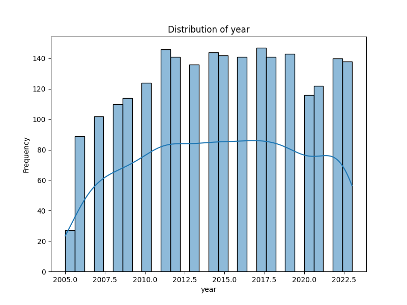
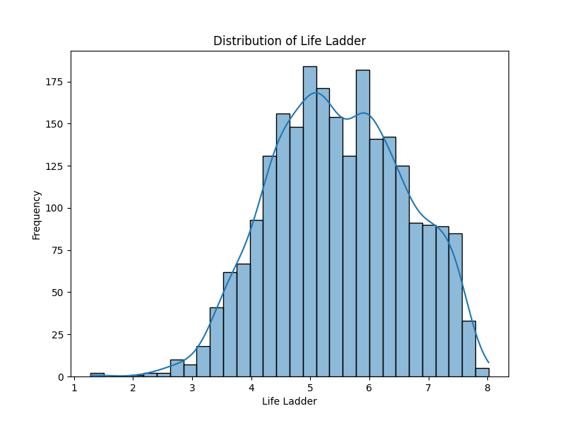

# Automated Data Analysis
## Dataset Overview
- Shape: 2363 rows and 11 columns
- Columns: Country name, year, Life Ladder, Log GDP per capita, Social support, Healthy life expectancy at birth, Freedom to make life choices, Generosity, Perceptions of corruption, Positive affect, Negative affect

## Insights
### Story of Global Well-Being: Insights from the Dataset

In our quest to understand human well-being across the globe, a comprehensive dataset consisting of 2,363 observations across 11 critical variables has provided a lens through which we can examine the factors leading to life satisfaction, happiness, and the overall quality of life in various countries. 

#### The Structure of Well-Being

At the heart of this dataset lies the **Life Ladder**, a measure often used in happiness research to quantify subjective well-being. Available data from various countries over a span of years elucidates how different elements contribute to life satisfaction. This measure serves as both a beacon and a benchmark, reflecting the holistic experience of people in diverse environments.

The dataset also contains quantifiable metrics allowing us to delve into factors that contribute to this Life Ladder measurement, including **Social Support, Log GDP per Capita, Healthy Life Expectancy, Freedom to Make Life Choices, Generosity, Perceptions of Corruption, Positive Affect, and Negative Affect**. Each of these factors offers a unique insight into what shapes human satisfaction and happiness.

#### Insights from the Analysis

1. **Economic and Social Factors**: 
   - The variable **Log GDP per Capita** often correlates strongly with the Life Ladder scores; higher economic prosperity tends to align with improved life satisfaction. However, with 28 missing values in this column, it’s critical to consider how data gaps might affect our conclusions about wealth disparities across different nations.

2. **Social Support**: 
   - The **Social Support** metric, with 13 missing values, reveals its pivotal role in individual well-being. Countries with robust networks of support tend to have citizens who report higher life satisfaction. This suggests a societal obligation to foster community and social ties.

3. **Health as a Foundation**:
   - The **Healthy Life Expectancy at Birth** variable underscores a significant finding: health is a primary determinant of happiness. Missing for 63 observations, this data presents a challenge but also highlights the importance of health equity in promoting overall satisfaction.

4. **Freedom and Agency**:
   - The **Freedom to Make Life Choices** is another crucial parameter, with 36 missing values. Countries that prioritize individual freedoms tend to witness higher life satisfaction, reaffirming the belief that autonomy plays a fundamental role in happiness.

5. **Generosity and Trust**: 
   - Interestingly, **Generosity** shows a striking 81 missing values. It poses an opportunity to investigate countries where economic struggle perhaps diminishes the capacity for altruism. Understanding generosity's role in building community and individual satisfaction could guide social policies in fostering a more supportive culture.

6. **Perceptions of Corruption**: 
   - A significant number of 125 missing values in the **Perceptions of Corruption** variable suggests discrepancies in how trust in institutions affects well-being. Countries with higher corruption perceptions typically have lower life satisfaction, emphasizing the need for transparency and fair governance.

7. **Emotional Landscape**: 
   - The emotional aspects denoted by **Positive Affect** (with 24 missing values) and **Negative Affect** (with 16 missing values) provide a dual lens on happiness. The balance of positive to negative emotional experiences informs the overall Life Ladder scores, indicating that emotional health is just as pivotal as social or economic health.

#### Conclusion: A Call for Action

This dataset offers a rich tapestry of insights into what drives life satisfaction globally. It paints a complex picture where economics, health, social networks, and emotional well-being intersect. The missing values across various columns serve as a call to action; they urge further investigation and innovative data-gathering methods to deepen our understanding of global well-being.

As countries navigate through economic, social, and health challenges, insights from this dataset can guide policymakers and community leaders towards fostering environments where people thrive collectively. By addressing the factors contributing to those missing data points, a more holistic and inclusive approach to happiness can be achieved. Ultimately, it reaffirms the belief that the path to a happier world is paved with knowledge, compassion, and concerted efforts to support each individual's journey towards fulfillment and joy.
## Visualizations

