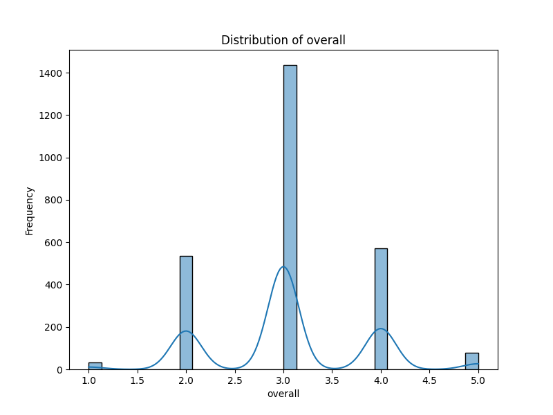
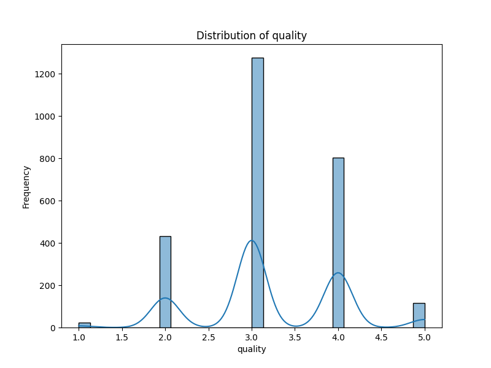

# Dataset Story

Here's a `README.md` file based on the provided data analysis details and image descriptions:
# Dataset Analysis Report
---
## Overview
This report presents an analysis of a dataset consisting of 2,652 rows and 8 columns. The dataset includes the following columns:
- **date**: The date of the record.
- **language**: The language used.
- **type**: The type of the entry.
- **title**: The title of the entry.
- **by**: The author or creator of the entry (with notable missing values).
- **overall**: Overall rating or score.
- **quality**: Quality rating of the entry.
- **repeatability**: Measure of repeatability for the entries.

### Missing Values
The dataset exhibits some missing values that need to be addressed:
- `date`: 99 missing values
- `by`: 262 missing values
- All other columns have no missing values.
---
## Insights from the Data

### Correlation Analysis

The correlation heatmap provides insights into how various features relate to each other. A strong correlation can suggest relationships that might be useful in predicting other variables or in understanding the entries better. Analyzing these relationships can help in feature selection for any predictive models that might be developed down the line.

### Life Ladder Distribution

The Life Ladder distribution illustrates the ratings assigned to various entries, potentially indicating the overall sentiment or satisfaction levels captured in the dataset. Observing the distribution allows us to understand biases in the responses and the general trend among ratings over time.

### Overall Rating Distribution

The overall rating distribution highlights the frequency of scores across the dataset. This visual aids in identifying common ratings and possible outliers. Understanding the distribution of overall ratings is crucial for assessing the average performance of entries.

### Quality Rating Distribution

Similarly, the quality rating distribution gives insight into how quality has been rated within the dataset. This information can help determine whether quality and overall ratings align, and point towards consistent or erratic reporting.

The yearly distribution showcases how records are spread across different years. Analyzing temporal trends can reveal patterns in data collection, shifts in language or type entries, and changes in overall or quality ratings over time. 

## Conclusion
The dataset holds valuable information, but attention must be directed towards addressing the missing values, especially in the `date` and `by` columns. Further analysis, as demonstrated in the visualizations, reveals important trends and relationships that can inform future exploration or model development. 

By understanding these insights, we can uncover deeper narratives within the data and enhance our decision-making processes.
